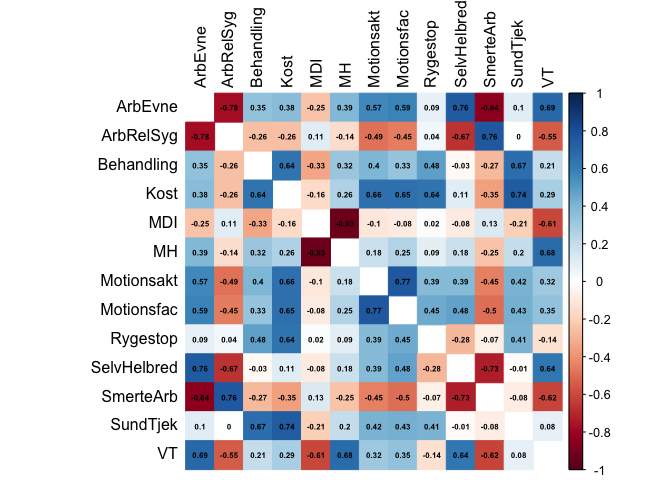
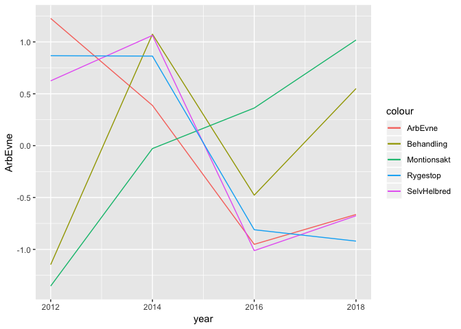
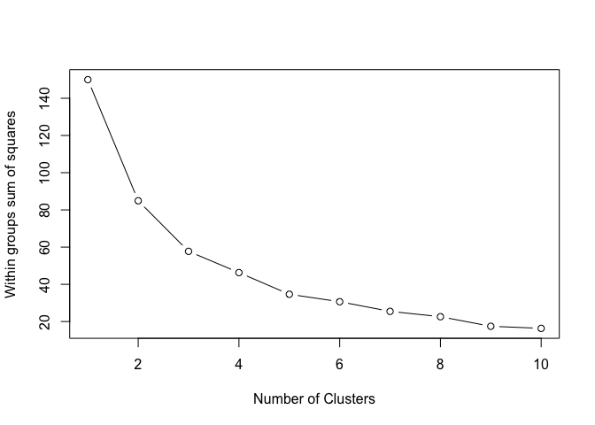

Dataopgave
================
Tiemo Thiess
22/6/2020

I started the task by generally exploring the data and thinking about how this data can help to solve a business problem for PFA. A common EDA does not seem to be appropriate as the data is already aggregated and presented as analysis results. Because of this, I choose to do a correlation analysis of variables that may be of interest for PFA such as the relationship between offering treatment programs and the overall workability. Ideally I would like to use the raw data of the 50000 respondents, but as this is not available, I am basing the analysis on the aggregated data. In the end of the analysis, I am using the results of the correlation analysis to create clusters of job profiles that could be a potential target group for PFA products and services.

Load packages and data
----------------------

Instead of joining the received datasets with the ones from prior years, I used the full dataset that was accesible via the NFA.

``` r
library(readxl)
library(tidyverse)
library(cluster)  
library(corrplot)
library(ggplot2)

data_raw<- read_excel("~/Documents/na18_tableau_resultater_Migrated Data.xls")
```

Filter data
-----------

I searched trough the different topics and found a subset of topics that could be potentially interesting for PFA. Also, I focus on the main group of job profiles.

``` r
topics_list <- c("Arbejdsevne",
            "Arbejdsrelateret sygdom",
            "Begrænset i arbejdet pga. smerter" ,
            "Depressive symptomer",
            "Mental sundhed",
            "Selvvurderet helbred",
            "Tilbud om behandlingsordning",
            "Tilbud om motionsfaciliteter eller ugentlig motion",
            "Tilbud om rygestop",
            "Tilbud om små motionsaktiviteter i dagligdagen",
            "Tilbud om sund kost/kostvejledning",
            "Tilbud om sundhedstjek",
            "Vitalitet")

names(data_raw) <- gsub(" ", "_", names(data_raw)) # remove spaces
names(data_raw) <- tolower(names(data_raw)) # tranform to lower case column names
data <- data_raw %>% 
  filter(main_group == 'Job') %>%
  filter(title %in% topics_list)
```

Tidy data
---------

To perform a correlation analysis, I reshaped the data from a long into a tidy wide format in which each row is a different job profile and each column is a variable that is related to the survey questions.

``` r
# From long to wide
data_wide <- data %>%
  select(group, question, score) %>%
  drop_na() %>%
  mutate(id=1:n()) %>%
  spread(question, score) %>%
  select(-id) %>%
  group_by(group) %>%
  summarise_if(is.numeric, mean, na.rm = TRUE)

head(data_wide)
```

    ## # A tibble: 6 x 14
    ##   group ArbEvne ArbRelSyg Behandling  Kost   MDI    MH Motionsakt
    ##   <chr>   <dbl>     <dbl>      <dbl> <dbl> <dbl> <dbl>      <dbl>
    ## 1 Bibl…    8.54     12.1        46.1 13.8   9.11  77.9      24.2 
    ## 2 Bogh…    8.65      9.04       61.5 22.6   8.79  79.1      31.6 
    ## 3 Bran…    8.33     13.9        50.6 12.1   8.74  78.9      18.2 
    ## 4 Bude…    8.05     18.9        32.4 12.9  10.2   75.7      13.2 
    ## 5 Bus-…    8.10     15.4        44.3 21.4   7.95  80.6      12.9 
    ## 6 Buti…    8.30      9.97       25.7  8.45  9.93  76.6       6.75
    ## # … with 6 more variables: Motionsfac <dbl>, Rygestop <dbl>,
    ## #   SelvHelbred <dbl>, SmerteArb <dbl>, SundTjek <dbl>, VT <dbl>

Correlation analysis
--------------------

``` r
scaled <- scale(data_wide[, -1])
cor <- cor(scaled)
corrplot(cor, method="color", tl.col = "black", addCoef.col = "black", number.cex = 0.5, diag=FALSE)
```



Insights
--------

From the correlation analysis, I derived some insights.

1.  Offering sports or general treatment opportunities seems to have positive effects on workability, work related sickness, depression, pain, and vitality

2.  Offering support for stopping smoking has only moderate effects on most variables but positive effects on the self-assessed health

3.  Offering general health checks seems to have less benefitial effects than general treatment programs and sports offerings

``` r
# Development over the years
data_wide_years <- data %>%
  select(question, year, score) %>%
  mutate(year = as.character(year)) %>%
  drop_na() %>%
  mutate(id=1:n()) %>%
  spread(question, score) %>%
  select(-id) %>%
  group_by(year) %>%
  summarise_if(is.numeric, mean, na.rm = TRUE) %>%
  mutate_if(is.numeric, scale) %>%
  mutate(year = as.numeric(year))

summary(data_wide_years)
```

    ##       year           ArbEvne.V1          ArbRelSyg.V1    
    ##  Min.   :2012   Min.   :-0.9512037   Min.   :-0.7617987  
    ##  1st Qu.:2014   1st Qu.:-0.7352640   1st Qu.:-0.6741480  
    ##  Median :2015   Median :-0.1377759   Median :-0.3268523  
    ##  Mean   :2015   Mean   : 0.0000000   Mean   : 0.0000000  
    ##  3rd Qu.:2016   3rd Qu.: 0.5974881   3rd Qu.: 0.3472958  
    ##  Max.   :2018   Max.   : 1.2267556   Max.   : 1.4155033  
    ##     Behandling.V1           Kost.V1               MDI.V1       
    ##  Min.   :-1.1469247   Min.   :-1.0665852   Min.   :-0.9508344  
    ##  1st Qu.:-0.6448166   1st Qu.:-0.7146308   1st Qu.:-0.8099032  
    ##  Median : 0.0363562   Median :-0.0058359   Median :-0.0283309  
    ##  Mean   : 0.0000000   Mean   : 0.0000000   Mean   : 0.0000000  
    ##  3rd Qu.: 0.6811728   3rd Qu.: 0.7087949   3rd Qu.: 0.7815722  
    ##  Max.   : 1.0742124   Max.   : 1.0782571   Max.   : 1.0074962  
    ##         MH.V1            Motionsakt.V1        Motionsfac.V1    
    ##  Min.   :-1.0015334   Min.   :-1.3531272   Min.   :-0.9352461  
    ##  1st Qu.:-0.7378808   1st Qu.:-0.3591405   1st Qu.:-0.8089071  
    ##  Median :-0.0743886   Median : 0.1674778   Median :-0.0632857  
    ##  Mean   : 0.0000000   Mean   : 0.0000000   Mean   : 0.0000000  
    ##  3rd Qu.: 0.6634923   3rd Qu.: 0.5266183   3rd Qu.: 0.7456213  
    ##  Max.   : 1.1503105   Max.   : 1.0181716   Max.   : 1.0618176  
    ##      Rygestop.V1         SelvHelbred.V1        SmerteArb.V1    
    ##  Min.   :-0.9200169   Min.   :-1.0118940   Min.   :-1.0364339  
    ##  1st Qu.:-0.8377242   1st Qu.:-0.7596484   1st Qu.:-0.6474987  
    ##  Median : 0.0264963   Median :-0.0254164   Median :-0.1074539  
    ##  Mean   : 0.0000000   Mean   : 0.0000000   Mean   : 0.0000000  
    ##  3rd Qu.: 0.8642205   3rd Qu.: 0.7342321   3rd Qu.: 0.5400449  
    ##  Max.   : 0.8670243   Max.   : 1.0627267   Max.   : 1.2513417  
    ##      SundTjek.V1             VT.V1        
    ##  Min.   :-1.1232535   Min.   :-0.8664745  
    ##  1st Qu.:-0.7010994   1st Qu.:-0.8513181  
    ##  Median : 0.1112200   Median :-0.0859944  
    ##  Mean   : 0.0000000   Mean   : 0.0000000  
    ##  3rd Qu.: 0.8123194   3rd Qu.: 0.7653237  
    ##  Max.   : 0.9008135   Max.   : 1.0384634

``` r
head(data_wide_years)
```

    ## # A tibble: 4 x 14
    ##    year ArbEvne[,1] ArbRelSyg[,1] Behandling[,1] Kost[,1] MDI[,1] MH[,1]
    ##   <dbl>       <dbl>         <dbl>          <dbl>    <dbl>   <dbl>  <dbl>
    ## 1  2012       1.23       -0.00877         -1.15     1.08   -0.951  1.15 
    ## 2  2014       0.388      -0.762            1.07     0.586  -0.763  0.501
    ## 3  2016      -0.951       1.42            -0.477   -1.07    0.706 -0.650
    ## 4  2018      -0.663      -0.645            0.550   -0.597   1.01  -1.00 
    ## # … with 7 more variables: Motionsakt[,1] <dbl>, Motionsfac[,1] <dbl>,
    ## #   Rygestop[,1] <dbl>, SelvHelbred[,1] <dbl>, SmerteArb[,1] <dbl>,
    ## #   SundTjek[,1] <dbl>, VT[,1] <dbl>

``` r
# Visualization
ggplot(data_wide_years, aes(x=year), group = 1) + 
  geom_line(aes(y = ArbEvne, colour = "ArbEvne")) + 
  geom_line(aes(y = Behandling, colour = "Behandling")) +
  geom_line(aes(y = Motionsakt, colour = "Montionsakt")) + 
  geom_line(aes(y = SelvHelbred, colour = "SelvHelbred")) +
  geom_line(aes(y = Rygestop, colour = "Rygestop"))
```



``` r
# Cluster Analysis
scaled_filt <- dplyr::select(as.data.frame(scaled), SelvHelbred, Rygestop)
k <- kmeans(scaled_filt[, ], centers = 2, nstart = 25)
k
```

    ## K-means clustering with 2 clusters of sizes 50, 26
    ## 
    ## Cluster means:
    ##   SelvHelbred   Rygestop
    ## 1   0.4431521 -0.4990187
    ## 2  -0.8522155  0.9596514
    ## 
    ## Clustering vector:
    ##  [1] 1 1 2 1 2 1 2 2 2 2 1 1 1 1 2 1 1 1 1 2 2 1 1 1 1 1 2 1 1 2 1 1 2 1 1
    ## [36] 1 2 2 1 1 2 1 2 1 1 2 1 2 1 2 1 2 1 1 2 1 1 1 1 1 1 2 2 2 2 1 1 1 1 2
    ## [71] 1 1 1 1 1 1
    ## 
    ## Within cluster sum of squares by cluster:
    ## [1] 57.86067 27.04191
    ##  (between_SS / total_SS =  43.4 %)
    ## 
    ## Available components:
    ## 
    ## [1] "cluster"      "centers"      "totss"        "withinss"    
    ## [5] "tot.withinss" "betweenss"    "size"         "iter"        
    ## [9] "ifault"

``` r
# Elbow Plot
wssplot <- function(scaled_filt, nc=15, seed=1234){
  wss <- (nrow(scaled_filt)-1)*sum(apply(scaled_filt,2,var))
  for (i in 2:nc){
    set.seed(seed)
    wss[i] <- sum(kmeans(scaled_filt, centers=i)$withinss)}
  plot(1:nc, wss, type="b", xlab="Number of Clusters",
       ylab="Within groups sum of squares")}

wssplot(scaled_filt, nc=10) 
```



``` r
k2 <- kmeans(scaled_filt[, ], centers = 5, nstart = 25)
k2 #Insight 2 jobs and industries in cluster 1 are potential target groups
```

    ## K-means clustering with 5 clusters of sizes 18, 16, 13, 19, 10
    ## 
    ## Cluster means:
    ##   SelvHelbred    Rygestop
    ## 1  1.34582004 -0.30745200
    ## 2 -0.17483216 -1.18695029
    ## 3 -0.64759855  1.58669137
    ## 4  0.04380756  0.07775359
    ## 5 -1.38410087  0.24210345
    ## 
    ## Clustering vector:
    ##  [1] 1 4 4 2 3 2 5 3 3 5 2 1 4 2 3 2 1 1 1 4 5 1 1 2 4 2 5 4 4 3 1 4 5 1 2
    ## [36] 2 5 3 2 1 5 2 3 1 4 4 4 3 2 3 4 5 1 1 5 1 1 1 2 4 2 5 3 3 3 4 4 1 4 3
    ## [71] 4 2 4 1 4 2
    ## 
    ## Within cluster sum of squares by cluster:
    ## [1] 11.304900  9.078962  6.634304  4.519335  3.052696
    ##  (between_SS / total_SS =  76.9 %)
    ## 
    ## Available components:
    ## 
    ## [1] "cluster"      "centers"      "totss"        "withinss"    
    ## [5] "tot.withinss" "betweenss"    "size"         "iter"        
    ## [9] "ifault"

``` r
# Target group
clust_data <- cbind(data_wide[, 1], k2$cluster) %>%
  filter(k2$cluster == 2)
names(clust_data) <- c("group", "cluster")
clust_data
```

    ##                                     group cluster
    ## 1                         Bude og kurerer       2
    ## 2                           Butikssælgere       2
    ## 3                             Elektrikere       2
    ## 4                Frisører og kosmetologer       2
    ## 5                    Gartnere og landmænd       2
    ## 6                        Kasseassistenter       2
    ## 7                        Kokke og tjenere       2
    ## 8                                  Malere       2
    ## 9  Manuelt arbejde uden nærmere angivelse       2
    ## 10                             Mekanikere       2
    ## 11                  Murere, VVS´ere m.fl.       2
    ## 12             Politi og fængselsbetjente       2
    ## 13                    Servicefag i øvrigt       2
    ## 14                     Slagtere og bagere       2
    ## 15                    Tømrere og snedkere       2
    ## 16                                Uoplyst       2
