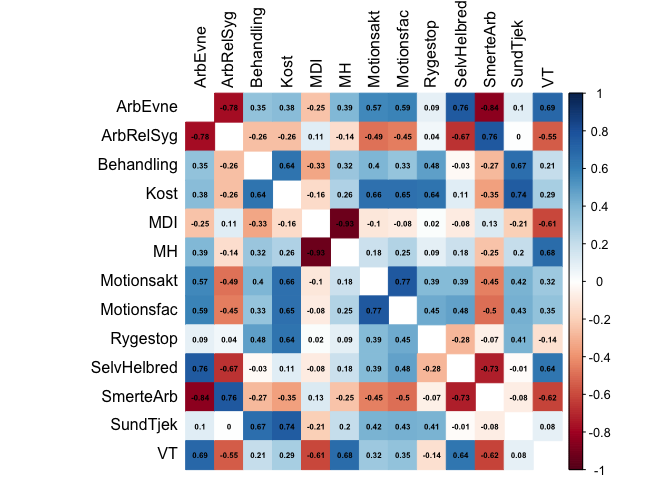
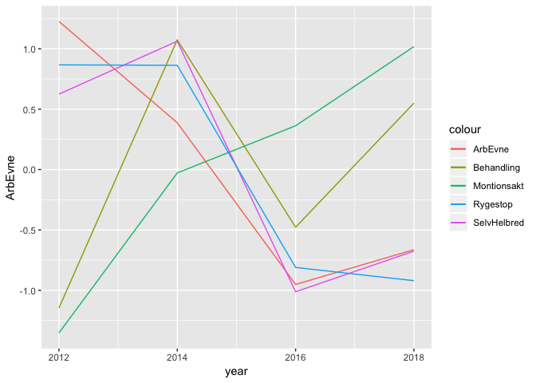
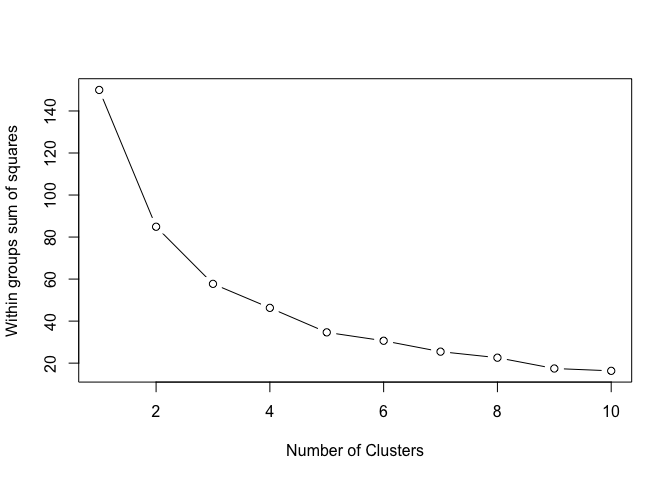

Dataopgave
================
Tiemo Thiess
22/6/2020

I started the task by generally exploring the data and thinking about how this data can help to solve a business problem for PFA. A common EDA does not seem to be appropriate as the data is already aggregated and presented as analysis results. Because of this, I choose to do a correlation analysis of variables that may be of interest for PFA such as the relationship between offering treatment programs and the overall workability. Ideally I would like to use the raw data of the 50000 respondents, but as this is not available, I am basing the analysis on the aggregated data. In the end of the analysis, I am using the results of the correlation analysis to create clusters of job profiles that could be used as a target group for marketing regarding PFA products and services.

Load packages and data
----------------------

Instead of joining the received datasets with the ones from prior years, I use the full dataset that is accesible via the NFA.

``` r
library(readxl)
library(tidyverse)
library(cluster)  
library(corrplot)
library(ggplot2)

data_raw<- read_excel("~/Documents/na18_tableau_resultater_Migrated Data.xls")
```

Filter data
-----------

I searched trough the different topics and found a subset of topics that could be potentially interesting for PFA. Also, I focus on the main group of job profiles.

``` r
topics_list <- c("Arbejdsevne",
            "Arbejdsrelateret sygdom",
            "Begrænset i arbejdet pga. smerter" ,
            "Depressive symptomer",
            "Mental sundhed",
            "Selvvurderet helbred",
            "Tilbud om behandlingsordning",
            "Tilbud om motionsfaciliteter eller ugentlig motion",
            "Tilbud om rygestop",
            "Tilbud om små motionsaktiviteter i dagligdagen",
            "Tilbud om sund kost/kostvejledning",
            "Tilbud om sundhedstjek",
            "Vitalitet")

names(data_raw) <- gsub(" ", "_", names(data_raw)) # remove spaces
names(data_raw) <- tolower(names(data_raw)) # tranform to lower case column names
data <- data_raw %>% 
  filter(main_group == 'Job') %>%
  filter(title %in% topics_list)
```

Tidy data
---------

To perform a correlation analysis, I reshape the data from a long into a tidy wide format in which each row is a different job profile and each column is a variable that is related to the survey questions (topics).

``` r
# From long to wide
data_wide <- data %>%
  select(group, question, score) %>%
  drop_na() %>%
  mutate(id=1:n()) %>%
  spread(question, score) %>%
  select(-id) %>%
  group_by(group) %>%
  summarise_if(is.numeric, mean, na.rm = TRUE)

head(data_wide)
```

    ## # A tibble: 6 x 14
    ##   group ArbEvne ArbRelSyg Behandling  Kost   MDI    MH Motionsakt
    ##   <chr>   <dbl>     <dbl>      <dbl> <dbl> <dbl> <dbl>      <dbl>
    ## 1 Bibl…    8.54     12.1        46.1 13.8   9.11  77.9      24.2 
    ## 2 Bogh…    8.65      9.04       61.5 22.6   8.79  79.1      31.6 
    ## 3 Bran…    8.33     13.9        50.6 12.1   8.74  78.9      18.2 
    ## 4 Bude…    8.05     18.9        32.4 12.9  10.2   75.7      13.2 
    ## 5 Bus-…    8.10     15.4        44.3 21.4   7.95  80.6      12.9 
    ## 6 Buti…    8.30      9.97       25.7  8.45  9.93  76.6       6.75
    ## # … with 6 more variables: Motionsfac <dbl>, Rygestop <dbl>,
    ## #   SelvHelbred <dbl>, SmerteArb <dbl>, SundTjek <dbl>, VT <dbl>

### A basic summary of the data

``` r
summary(data_wide)
```

    ##     group              ArbEvne        ArbRelSyg        Behandling   
    ##  Length:76          Min.   :7.776   Min.   : 5.187   Min.   :15.59  
    ##  Class :character   1st Qu.:8.173   1st Qu.: 8.342   1st Qu.:31.90  
    ##  Mode  :character   Median :8.371   Median :11.550   Median :40.50  
    ##                     Mean   :8.377   Mean   :12.206   Mean   :40.52  
    ##                     3rd Qu.:8.565   3rd Qu.:15.470   3rd Qu.:49.01  
    ##                     Max.   :8.900   Max.   :24.291   Max.   :61.48  
    ##       Kost             MDI               MH          Motionsakt    
    ##  Min.   : 0.000   Min.   : 6.803   Min.   :74.69   Min.   : 4.171  
    ##  1st Qu.: 9.469   1st Qu.: 8.053   1st Qu.:78.26   1st Qu.:11.821  
    ##  Median :13.134   Median : 8.691   Median :78.96   Median :18.442  
    ##  Mean   :13.238   Mean   : 8.676   Mean   :79.11   Mean   :20.201  
    ##  3rd Qu.:16.415   3rd Qu.: 9.153   3rd Qu.:80.18   3rd Qu.:27.743  
    ##  Max.   :28.151   Max.   :11.322   Max.   :82.55   Max.   :56.537  
    ##    Motionsfac        Rygestop      SelvHelbred      SmerteArb     
    ##  Min.   : 5.228   Min.   : 0.00   Min.   :3.250   Min.   : 0.176  
    ##  1st Qu.:24.956   1st Qu.:10.87   1st Qu.:3.473   1st Qu.: 3.478  
    ##  Median :36.626   Median :14.25   Median :3.558   Median : 4.940  
    ##  Mean   :35.066   Mean   :14.74   Mean   :3.567   Mean   : 5.285  
    ##  3rd Qu.:41.493   3rd Qu.:17.90   3rd Qu.:3.682   3rd Qu.: 6.952  
    ##  Max.   :83.233   Max.   :27.80   Max.   :3.982   Max.   :11.521  
    ##     SundTjek            VT       
    ##  Min.   : 2.572   Min.   :57.84  
    ##  1st Qu.:11.343   1st Qu.:61.13  
    ##  Median :17.668   Median :62.20  
    ##  Mean   :18.912   Mean   :62.31  
    ##  3rd Qu.:24.763   3rd Qu.:63.84  
    ##  Max.   :62.998   Max.   :68.97

Correlation analysis
--------------------

``` r
scaled <- scale(data_wide[, -1])
cor <- cor(scaled)
corrplot(cor, method="color", tl.col = "black", addCoef.col = "black", number.cex = 0.5, diag=FALSE)
```



Insights
--------

From the correlation analysis, I derived some insights.

1.  Offering sports or general treatment opportunities seems to have positive effects on workability, work related sickness, depression, pain, and vitality

2.  Offering support for stopping smoking seems to have only moderate effects on most variables but positive effects on the self-assessed health

3.  Offering general health checks seems to have less benefitial effects than general treatment programs and sports offerings

Development over the years
==========================

To see some general trends over time, I plot the main variables of interested for the years 2012, 2014, 2016. and 2018.

``` r
data_wide_years <- data %>%
  select(question, year, score) %>%
  mutate(year = as.character(year)) %>%
  drop_na() %>%
  mutate(id=1:n()) %>%
  spread(question, score) %>%
  select(-id) %>%
  group_by(year) %>%
  summarise_if(is.numeric, mean, na.rm = TRUE) %>%
  mutate_if(is.numeric, scale) %>%
  mutate(year = as.numeric(year))


head(data_wide_years)
```

    ## # A tibble: 4 x 14
    ##    year ArbEvne[,1] ArbRelSyg[,1] Behandling[,1] Kost[,1] MDI[,1] MH[,1]
    ##   <dbl>       <dbl>         <dbl>          <dbl>    <dbl>   <dbl>  <dbl>
    ## 1  2012       1.23       -0.00877         -1.15     1.08   -0.951  1.15 
    ## 2  2014       0.388      -0.762            1.07     0.586  -0.763  0.501
    ## 3  2016      -0.951       1.42            -0.477   -1.07    0.706 -0.650
    ## 4  2018      -0.663      -0.645            0.550   -0.597   1.01  -1.00 
    ## # … with 7 more variables: Motionsakt[,1] <dbl>, Motionsfac[,1] <dbl>,
    ## #   Rygestop[,1] <dbl>, SelvHelbred[,1] <dbl>, SmerteArb[,1] <dbl>,
    ## #   SundTjek[,1] <dbl>, VT[,1] <dbl>

### A basic summary of the data

``` r
summary(data_wide_years)
```

    ##       year           ArbEvne.V1          ArbRelSyg.V1    
    ##  Min.   :2012   Min.   :-0.9512037   Min.   :-0.7617987  
    ##  1st Qu.:2014   1st Qu.:-0.7352640   1st Qu.:-0.6741480  
    ##  Median :2015   Median :-0.1377759   Median :-0.3268523  
    ##  Mean   :2015   Mean   : 0.0000000   Mean   : 0.0000000  
    ##  3rd Qu.:2016   3rd Qu.: 0.5974881   3rd Qu.: 0.3472958  
    ##  Max.   :2018   Max.   : 1.2267556   Max.   : 1.4155033  
    ##     Behandling.V1           Kost.V1               MDI.V1       
    ##  Min.   :-1.1469247   Min.   :-1.0665852   Min.   :-0.9508344  
    ##  1st Qu.:-0.6448166   1st Qu.:-0.7146308   1st Qu.:-0.8099032  
    ##  Median : 0.0363562   Median :-0.0058359   Median :-0.0283309  
    ##  Mean   : 0.0000000   Mean   : 0.0000000   Mean   : 0.0000000  
    ##  3rd Qu.: 0.6811728   3rd Qu.: 0.7087949   3rd Qu.: 0.7815722  
    ##  Max.   : 1.0742124   Max.   : 1.0782571   Max.   : 1.0074962  
    ##         MH.V1            Motionsakt.V1        Motionsfac.V1    
    ##  Min.   :-1.0015334   Min.   :-1.3531272   Min.   :-0.9352461  
    ##  1st Qu.:-0.7378808   1st Qu.:-0.3591405   1st Qu.:-0.8089071  
    ##  Median :-0.0743886   Median : 0.1674778   Median :-0.0632857  
    ##  Mean   : 0.0000000   Mean   : 0.0000000   Mean   : 0.0000000  
    ##  3rd Qu.: 0.6634923   3rd Qu.: 0.5266183   3rd Qu.: 0.7456213  
    ##  Max.   : 1.1503105   Max.   : 1.0181716   Max.   : 1.0618176  
    ##      Rygestop.V1         SelvHelbred.V1        SmerteArb.V1    
    ##  Min.   :-0.9200169   Min.   :-1.0118940   Min.   :-1.0364339  
    ##  1st Qu.:-0.8377242   1st Qu.:-0.7596484   1st Qu.:-0.6474987  
    ##  Median : 0.0264963   Median :-0.0254164   Median :-0.1074539  
    ##  Mean   : 0.0000000   Mean   : 0.0000000   Mean   : 0.0000000  
    ##  3rd Qu.: 0.8642205   3rd Qu.: 0.7342321   3rd Qu.: 0.5400449  
    ##  Max.   : 0.8670243   Max.   : 1.0627267   Max.   : 1.2513417  
    ##      SundTjek.V1             VT.V1        
    ##  Min.   :-1.1232535   Min.   :-0.8664745  
    ##  1st Qu.:-0.7010994   1st Qu.:-0.8513181  
    ##  Median : 0.1112200   Median :-0.0859944  
    ##  Mean   : 0.0000000   Mean   : 0.0000000  
    ##  3rd Qu.: 0.8123194   3rd Qu.: 0.7653237  
    ##  Max.   : 0.9008135   Max.   : 1.0384634

### The visualization

The visualization emphasizes especially the association between the self-assessed health and offers for stopping smoking. It also shows a steep increase in offers for sports.

``` r
ggplot(data_wide_years, aes(x=year), group = 1) + 
  geom_line(aes(y = ArbEvne, colour = "ArbEvne")) + 
  geom_line(aes(y = Behandling, colour = "Behandling")) +
  geom_line(aes(y = Motionsakt, colour = "Montionsakt")) + 
  geom_line(aes(y = SelvHelbred, colour = "SelvHelbred")) +
  geom_line(aes(y = Rygestop, colour = "Rygestop"))
```



Cluster Analysis
================

We have found out that offering treatment programs, sports, and smoking stopping support can increase work ability and health. For PFA, this means that when customers that are unhealthy are offered, for instance, sports programs, it could increase their health and consequently lower the probability that customers have to use services and treatments that are expensive for PFA. As it can be inefficient to offer sports programs or smoking stopping support to everyone, we conduct a clustering analysis to find job profiles that are in a cluster that shows high potential as it has, for instance, a low average self-assessed health, and so far only little or no smoking stopping support.

### Initial model

``` r
scaled_filt <- dplyr::select(as.data.frame(scaled), SelvHelbred, Rygestop)
k <- kmeans(scaled_filt[, ], centers = 2, nstart = 25)
k
```

    ## K-means clustering with 2 clusters of sizes 50, 26
    ## 
    ## Cluster means:
    ##   SelvHelbred   Rygestop
    ## 1   0.4431521 -0.4990187
    ## 2  -0.8522155  0.9596514
    ## 
    ## Clustering vector:
    ##  [1] 1 1 2 1 2 1 2 2 2 2 1 1 1 1 2 1 1 1 1 2 2 1 1 1 1 1 2 1 1 2 1 1 2 1 1
    ## [36] 1 2 2 1 1 2 1 2 1 1 2 1 2 1 2 1 2 1 1 2 1 1 1 1 1 1 2 2 2 2 1 1 1 1 2
    ## [71] 1 1 1 1 1 1
    ## 
    ## Within cluster sum of squares by cluster:
    ## [1] 57.86067 27.04191
    ##  (between_SS / total_SS =  43.4 %)
    ## 
    ## Available components:
    ## 
    ## [1] "cluster"      "centers"      "totss"        "withinss"    
    ## [5] "tot.withinss" "betweenss"    "size"         "iter"        
    ## [9] "ifault"

### Elbow plot

To decide how many clusters to use

``` r
wssplot <- function(scaled_filt, nc=15, seed=1234){
  wss <- (nrow(scaled_filt)-1)*sum(apply(scaled_filt,2,var))
  for (i in 2:nc){
    set.seed(seed)
    wss[i] <- sum(kmeans(scaled_filt, centers=i)$withinss)}
  plot(1:nc, wss, type="b", xlab="Number of Clusters",
       ylab="Within groups sum of squares")}

wssplot(scaled_filt, nc=10) 
```



### Final Model

``` r
k2 <- kmeans(scaled_filt[, ], centers = 5, nstart = 25)
k2
```

    ## K-means clustering with 5 clusters of sizes 18, 16, 13, 19, 10
    ## 
    ## Cluster means:
    ##   SelvHelbred    Rygestop
    ## 1  1.34582004 -0.30745200
    ## 2 -0.17483216 -1.18695029
    ## 3 -0.64759855  1.58669137
    ## 4  0.04380756  0.07775359
    ## 5 -1.38410087  0.24210345
    ## 
    ## Clustering vector:
    ##  [1] 1 4 4 2 3 2 5 3 3 5 2 1 4 2 3 2 1 1 1 4 5 1 1 2 4 2 5 4 4 3 1 4 5 1 2
    ## [36] 2 5 3 2 1 5 2 3 1 4 4 4 3 2 3 4 5 1 1 5 1 1 1 2 4 2 5 3 3 3 4 4 1 4 3
    ## [71] 4 2 4 1 4 2
    ## 
    ## Within cluster sum of squares by cluster:
    ## [1] 11.304900  9.078962  6.634304  4.519335  3.052696
    ##  (between_SS / total_SS =  76.9 %)
    ## 
    ## Available components:
    ## 
    ## [1] "cluster"      "centers"      "totss"        "withinss"    
    ## [5] "tot.withinss" "betweenss"    "size"         "iter"        
    ## [9] "ifault"

### Output

Job profiles to target for preventive measures

``` r
clust_data <- cbind(data_wide[, 1], k2$cluster) %>%
  filter(k2$cluster == 2)
names(clust_data) <- c("group", "cluster")
clust_data
```

    ##                                     group cluster
    ## 1                         Bude og kurerer       2
    ## 2                           Butikssælgere       2
    ## 3                             Elektrikere       2
    ## 4                Frisører og kosmetologer       2
    ## 5                    Gartnere og landmænd       2
    ## 6                        Kasseassistenter       2
    ## 7                        Kokke og tjenere       2
    ## 8                                  Malere       2
    ## 9  Manuelt arbejde uden nærmere angivelse       2
    ## 10                             Mekanikere       2
    ## 11                  Murere, VVS´ere m.fl.       2
    ## 12             Politi og fængselsbetjente       2
    ## 13                    Servicefag i øvrigt       2
    ## 14                     Slagtere og bagere       2
    ## 15                    Tømrere og snedkere       2
    ## 16                                Uoplyst       2
